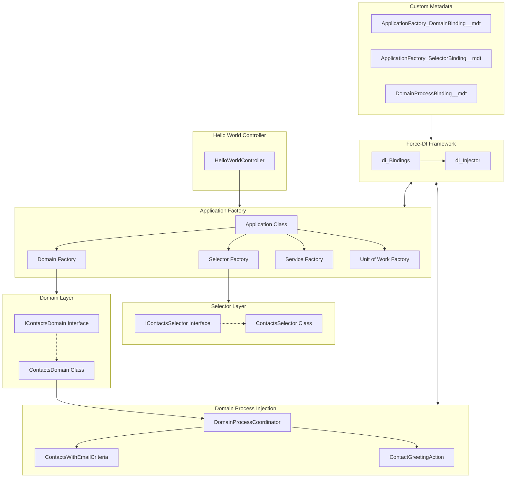
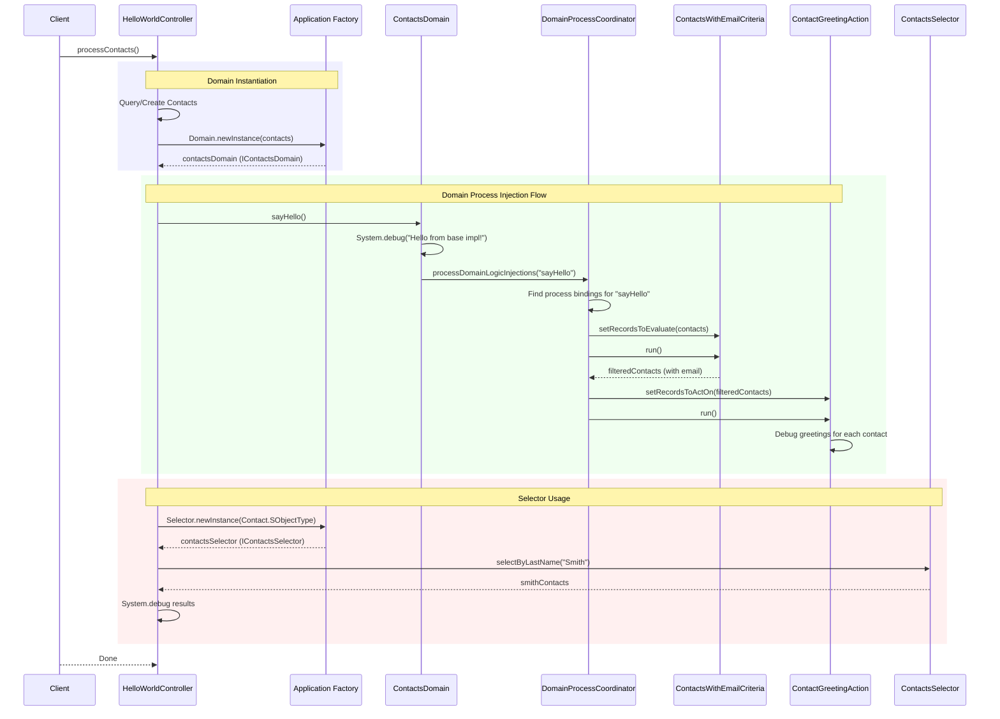
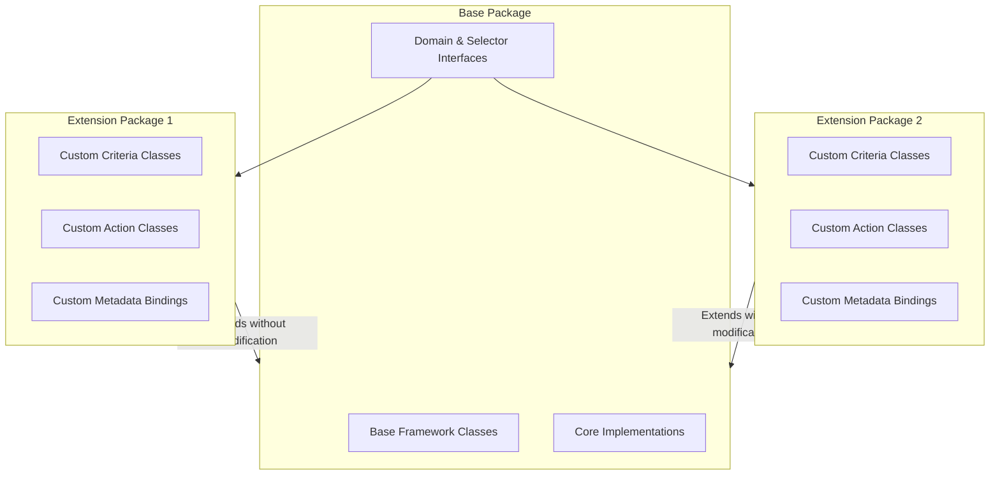

# AT4DX Architecture Diagrams

## Component Architecture

The following diagram shows the main components of the AT4DX framework and how they interact:

## Execution Flow

The sequence diagram below shows the flow of execution in our Hello World application:

## Package Modularity

The following diagram illustrates how AT4DX enables modular package development:

